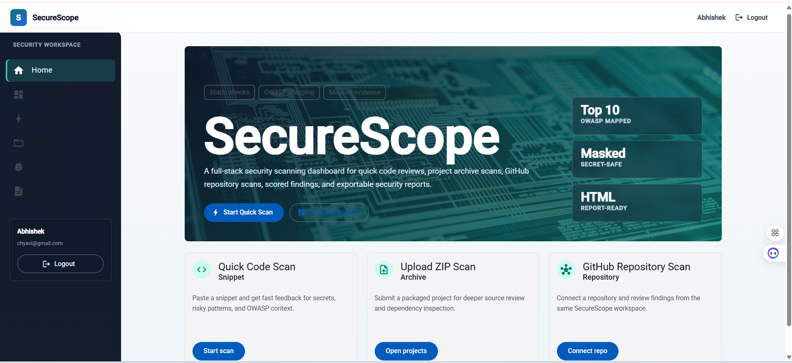
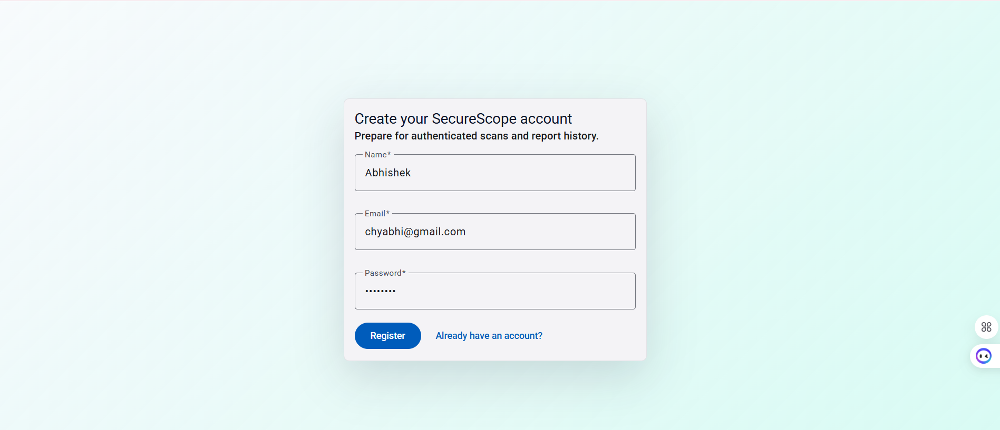
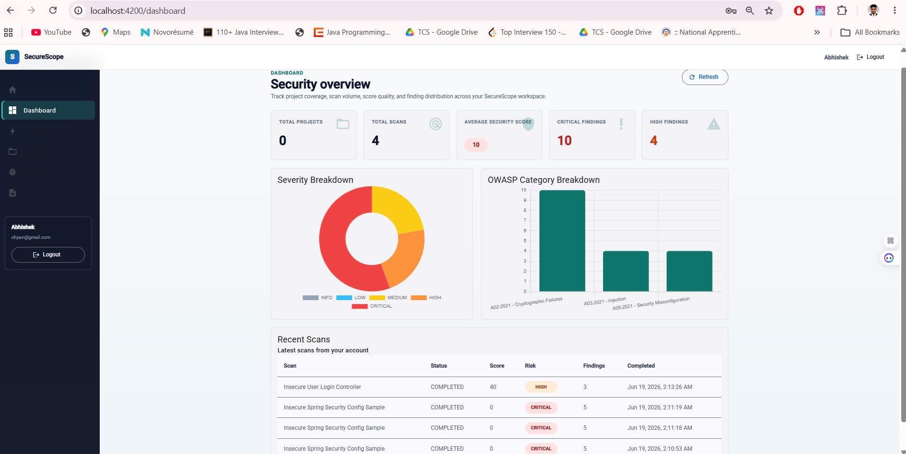
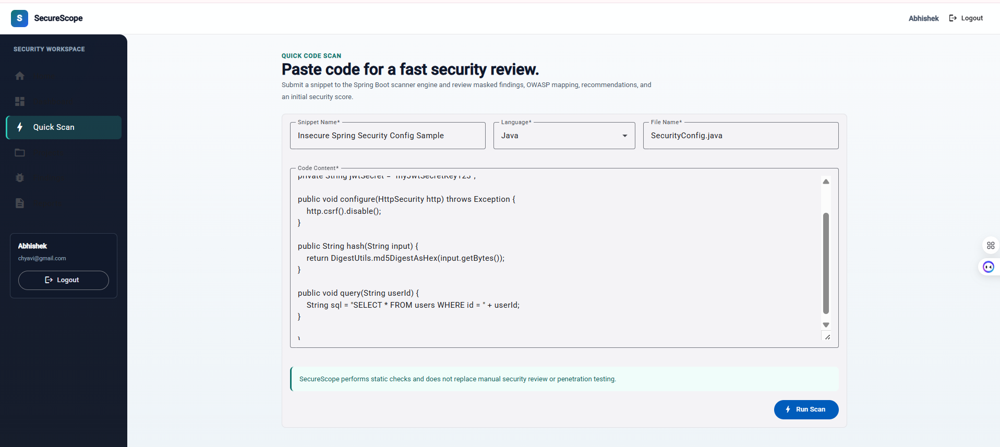
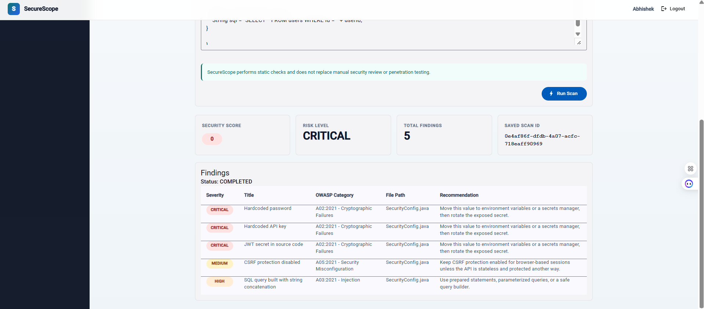
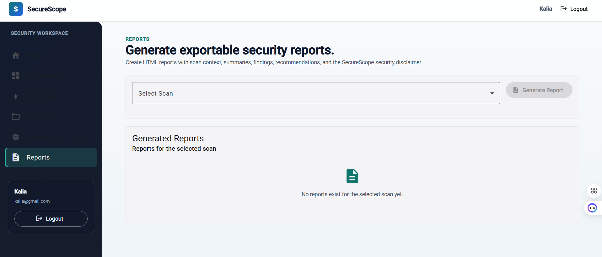

# SecureScope

SecureScope is a full-stack security scanning dashboard built with Angular and Spring Boot. It lets a user run basic static checks on pasted code, uploaded ZIP files, and public GitHub repositories.

The scanner looks for hardcoded secrets, risky code patterns, and example vulnerable dependencies. Results are saved with severity, OWASP-style mapping, a security score, and fix recommendations.

## Why I Built This

I built SecureScope to understand how security scanning tools work at a practical level. The project covers authentication, file upload handling, safe ZIP extraction, rule-based scanning, result storage, dashboard summaries, and HTML report generation.

## Main Features

- Register and log in with JWT authentication
- Run Quick Code Scan from pasted code
- Upload a ZIP file and scan supported project files
- Connect a public GitHub repository and scan its downloaded ZIP
- Detect common hardcoded secret patterns
- Detect risky patterns such as MD5, SHA1, disabled CSRF, permissive CORS, and SQL string concatenation
- Parse Maven `pom.xml` and npm `package.json`
- Flag sample vulnerable dependencies from a mock vulnerability list
- Save scans and findings
- View dashboard cards and charts
- Filter findings and update finding status
- Generate and download HTML security reports
- Mask sensitive evidence in results and reports

## Tech Stack

Backend:

- Java 17
- Spring Boot
- Spring Security
- Spring Data JPA
- Hibernate
- Maven
- JWT
- H2 for local development
- PostgreSQL profile for future use

Frontend:

- Angular
- TypeScript
- Angular Material
- RxJS
- SCSS
- Chart.js

## Screenshots

### Home Page



This screen shows the main SecureScope entry point with scan options.

### Registration



This screen shows the registration form used during the local demo.

### Dashboard



This screen shows saved scan metrics, severity breakdown, OWASP breakdown, and recent scans.

### Quick Code Scan



This screen shows a pasted Java sample before running the scanner.

### Scan Result



This screen shows the score, risk level, saved scan ID, and finding recommendations.

### Reports



This screen shows the reports page before selecting a scan.

Extra screenshots are available in `docs/screenshots`.

## How To Run Backend

The backend uses the `local` profile by default, so PostgreSQL is not required for local development.

```powershell
cd securescope-backend/securescope-backend
.\mvnw.cmd spring-boot:run
```

Useful local URLs:

- Backend: `http://localhost:8080`
- Health check: `http://localhost:8080/api/health`
- H2 console: `http://localhost:8080/h2-console`

H2 settings:

```text
JDBC URL: jdbc:h2:file:./data/securescope-db
Username: sa
Password: empty
```

## How To Run Frontend

```powershell
cd securescope-frontend
npm install
npm start
```

Frontend URL:

```text
http://localhost:4200
```

## How To Test Quick Code Scan

1. Start the backend.
2. Start the frontend.
3. Register or log in.
4. Open Quick Scan.
5. Paste sample code with a hardcoded secret or risky pattern.
6. Click Run Scan.
7. Review the score, risk level, findings, OWASP category, and recommendation.

Sample input:

```javascript
const password = "super-secret-password";
const apiKey = "sk_live_1234567890abcdef";
const hash = crypto.createHash("md5").update(password).digest("hex");
const query = "SELECT * FROM users WHERE email = '" + email + "'";
```

## Demo Flow

1. Start backend and frontend.
2. Register a demo user.
3. Run a Quick Code Scan.
4. Open Dashboard to review metrics.
5. Open Findings to review scanner output.
6. Create a project for ZIP or GitHub scans.
7. Generate an HTML report from a saved scan.

More notes are in [docs/DEMO_SCRIPT.md](docs/DEMO_SCRIPT.md).

## Known Limitations

- The scanner is rule-based and does not perform full static analysis.
- Dependency vulnerability data is mocked.
- GitHub scanning supports public repositories only.
- PDF report generation is not implemented.
- H2 is intended for local development only.
- A clean scan does not prove an application is secure.

## Future Improvements

- Integrate a real vulnerability database such as OSV or NVD
- Add GitHub OAuth for private repositories
- Add SARIF export
- Add CI/CD scan triggers
- Add deeper language-aware scanner rules
- Add Docker setup
- Add database migrations with Flyway or Liquibase

## Security Disclaimer

SecureScope performs static checks and basic rule-based scanning. It does not replace professional penetration testing, manual secure code review, enterprise SAST/SCA tools, threat modeling, compliance review, or runtime security testing.
